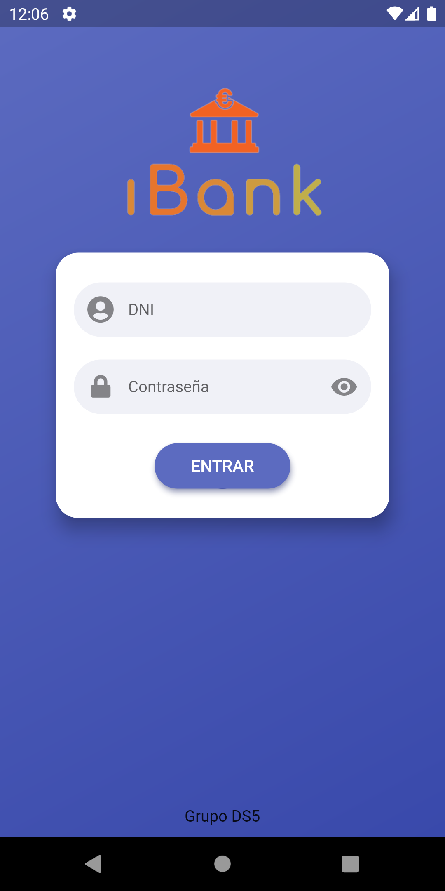
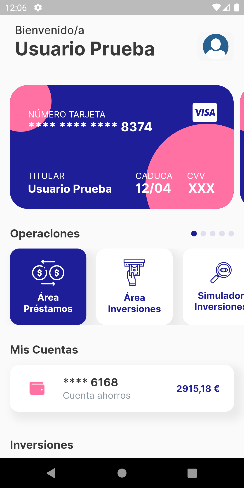
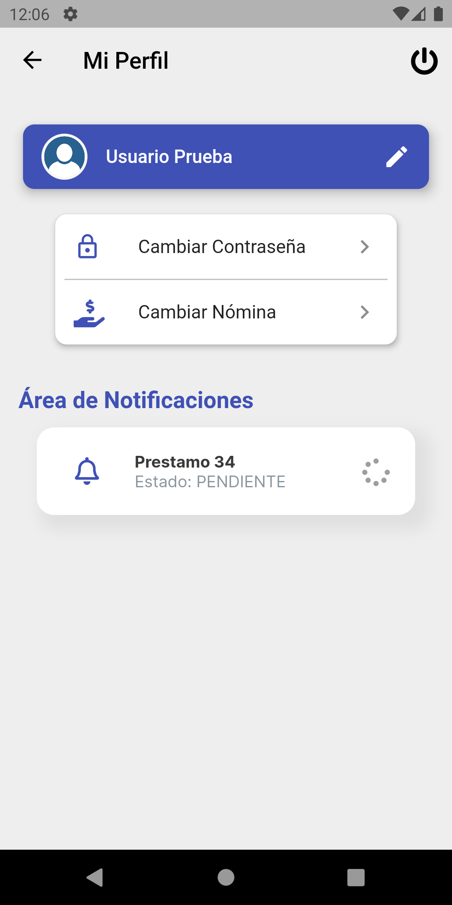
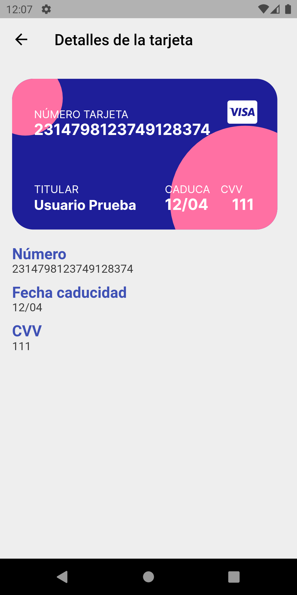
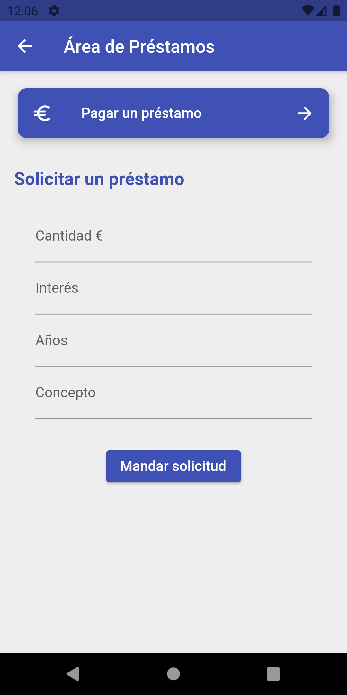

# Desarrollo del Software
> Asignatura 3º de Grado en Ingeniería Informática de la especialidad en Software.

## Práctica 4 : Desarrollo de una aplicación *multiplataforma*

### Planificación

> Sesión 1 y 2

- Diagrama de casos de uso
- Listado somero departes interesadas y preocupaciones de cada una
- Requisitos funcionales
- Requisitos no funcionales
- Diagrama que muestre la arquitectura del sistema desde el punto de vista del contexto
- Diagrama de base de datos
- Listado de criterios de calidad
- Diseño de pruebas del sistema e integración: condiciones de prueba y casos de prueba
- Diseño de pruebas de unidad, con casos y condiciones de prueba 
- Diagrama de clases de diseño

> Sesión 3 y 4

- Generar el código de la API
- Generar código de la aplicación Flutter

### Descripción del caso

El banco iBank que ha abierto recientemente en nuestro país nos solicita que le realicemos una aplicación software multiplataforma para su gestión de clientes y que los clientes puedan interaccionar con sus cuentas. Nos indica que los usuarios tienen una única cuenta asociada. Cada cuenta puede tener asociados unos préstamos, unas inversiones, unas tarjetas, unos movimientos y unas transferencias. El cliente puede realizar transferencias de su cuenta a otra del mismo banco. Además puede invertir parte de su saldo en acciones que puede, bien ganar dinero, o bien perder, en función de los filtros de cobro de bolsa y cobro de banco. También podrá simular una inversión mediante gráficas. Además todos los datos asociados a la cuenta deberán aparecer a modo de posición global en la aplicación. Las tarejtas deben de tener los números ocultos y mediante alguna opción que se revelen, para preservar los datos de sus clientes. El cliente puede solicitar tarjetas en caso de que haya perdido alguna, así que tenemos una operación que manda esta solicitud a la entidad. El cliente puede solicitar un préstamo al banco, que si supera los filtros de deudor y rentabilidad, mandará una solicitud a la entidad. Esta solicitud llegará al empleado para que la pueda aceptar o denegar, al igual que las tarjetas. Para terminar, sus clientes querrán resolver sus inversiones, una vez hechas y también querrán visualizar sus movimientos de la cuenta. También quieren tener un apartado de perfil para poder cambiar datos personales, como el nombre, la contraseña y la nómina y ver las notificaciones con el estado de las solicitudes.

### Diagrama

### App

| LOGIN  | INICIO | PERFIL |
| ------------- | ------------- | ------------- |
|   |   |   |

| VER DETALLES TARJETA  | SIMULADOR INVERSIÓN | PANEL PRESTAMOS |
| ------------- | ------------- | ------------- |
|   |   |   |

## Licencia

