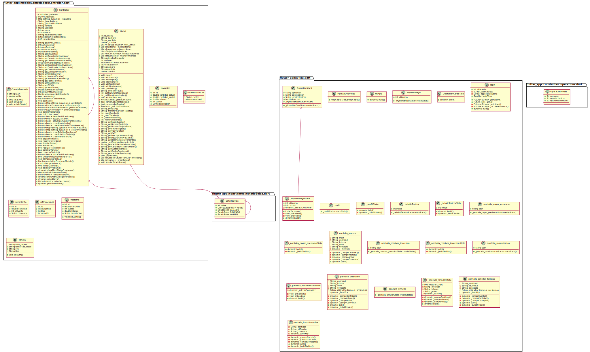
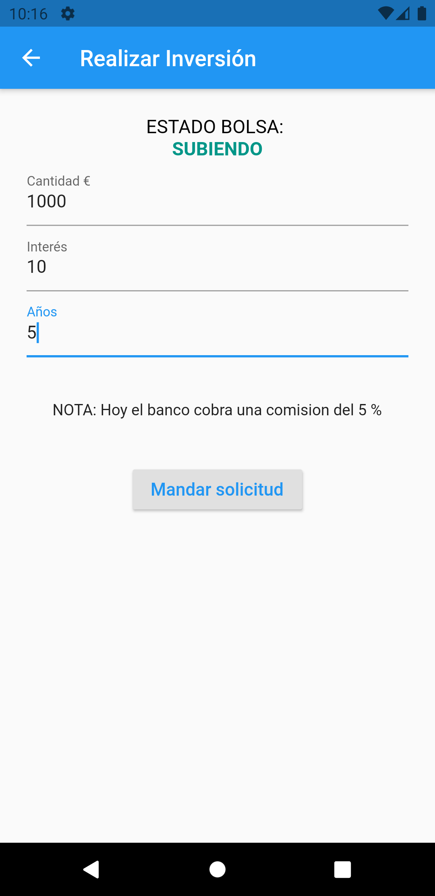

# Desarrollo del Software
> Asignatura 3º de Grado en Ingeniería Informática de la especialidad en Software.

## Práctica 2 : Reingeniería software con *código heredado (legacy code)*

> Sesión 1

- Diseñar diagrama usando Arquitectura Modelo-Vista-Controlador.
- Empezar a realizar el código de la app mediante Flutter y Dart.

> Sesión 2

- Terminar de realizar el código y la interfaz de la aplicación.

### Diagrama


### App
Para la ejecución de la app es necesario añadir el flag siguiente, ya que se usan librerías que no están
actualizadas.
```
--no-sound-null-safety
```

| INICIO  | PANEL INVERSIONES | 
| ------------- | ------------- |
|   |  |

## Licencia
[](http://creativecommons.org/licenses/by-nc-nd/4.0/)
